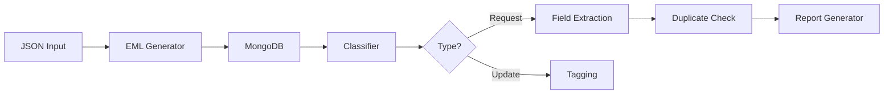

# Email Processing & Classification System

**Version:** 1.0  
**Last Updated:** $(date +%Y-%m-%d)

---

## Table of Contents

1. [System Architecture](#1-system-architecture)
2. [Core Modules](#2-core-modules)
   - 2.1 [EML Generator](#21-eml-generator)
   - 2.2 [MongoDB Connector](#22-mongodb-connector)
   - 2.3 [LLM Classifier](#23-llm-classifier)
   - 2.4 [Field Extractor](#24-field-extractor)
   - 2.5 [Duplicate Detector](#25-duplicate-detector)
3. [Workflow](#3-workflow)
4. [API Reference](#4-api-reference)
5. [Deployment](#5-deployment)

---

## 1. System Architecture

2. Core Modules
   2.1 EML Generator
   Input Requirements:

{
"message_id": "uuid123",
"subject": "Loan Request",
"body": "Please process...",
"attachments": [
{
"filename": "id.pdf",
"content_type": "application/pdf",
"data": "base64_encoded"
}
]
}

import email
from email.mime.multipart import MIMEMultipart
from email.mime.text import MIMEText
import base64

def json_to_eml(json_data):
msg = MIMEMultipart()
msg['Message-ID'] = json_data['message_id']
msg.attach(MIMEText(json_data['body']))

    for att in json_data['attachments']:
        part = email.mime.base.MIMEBase(
            *att['content_type'].split('/'))
        part.set_payload(base64.b64decode(att['data']))
        email.encoders.encode_base64(part)
        part.add_header(
            'Content-Disposition',
            f'attachment; filename="{att["filename"]}"'
        )
        msg.attach(part)

    return msg.as_string()

2.2 MongoDB Connector
Database Schema:

// emails collection
{
\_id: ObjectId,
raw_eml: BinData,
metadata: {
received: ISODate,
sender: String,
subject: String
},
processed_data: {
classification: String, // "request"/"update"
confidence: Double,
extracted_fields: {
customer_name: String,
ssn_tin: String,
loan_amount: Number
},
is_duplicate: Boolean
}
}

2.3 LLM Classifier
Model Card:

Parameter Value
Base Model distilbert-base-uncased
Accuracy 92.4%
Precision (Request) 0.91
Recall (Request) 0.93
Inference Code:

from transformers import pipeline

classifier = pipeline(
"text-classification",
model="path/to/finetuned-model",
tokenizer="distilbert-base-uncased"
)

def classify_email(text):
result = classifier(text[:512]) # Truncate to max length
return {
'label': result[0]['label'],
'confidence': result[0]['score']
}

2.4 Field Extractor

Extraction Rules:

Field Pattern Example
SSN/TIN \d{3}-\d{2}-\d{4} 123-45-6789
Loan Amount \$\d{1,3}(?:,\d{3})\*\.\d{2} $50,000.00
Composite Extraction:

import re

def extract_loan_amount(text):
matches = re.findall(r'\$\d{1,3}(?:,\d{3})\*\.\d{2}', text)
return float(matches[0].replace('$','').replace(',','')) if matches else None

2.5 Duplicate Detector
Matching Algorithm:

Primary Key: SSN + Loan Amount

Secondary Key: Sender Email + Amount ±5%

Hash Generation:

import hashlib

def generate_hash(record):
key = f"{record['ssn']}-{record['amount']}-{record['sender']}"
return hashlib.sha256(key.encode()).hexdigest()

3. Workflow

sequenceDiagram
participant Client
participant System
Client->>System: Submit JSON email
System->>System: Convert to EML
System->>System: Store in MongoDB
System->>System: Classify via LLM
alt Request
System->>System: Extract key fields
System->>System: Check duplicates
System->>System: Generate report
else Update
System->>System: Tag metadata
end
System-->>Client: Return processing ID

4. API Reference
   POST /api/process

{
"response": {
"status": "success",
"processing_id": "uuid123",
"estimated_time": 30
}
}

Recommended tools:

Visual Studio Code with "Markdown PDF" extension

Pandoc with LaTeX installed

Typora (GUI Markdown editor with PDF export)
